# Yolo-android-app

基于yolo模型编写的android app应用  共同作者[Qinxianshen](https://github.com/Qinxianshen) [ZeroNow](https://github.com/zeronow)

> * 使用face_recognition识别工人使用Yolo检测工人是否带防护设备
> * 使用Opencv识别微生物虾的个数
> * 基于Yolo、高德地图、科大讯飞制作的博物馆智能播报系统
> * 基于Yolo制作的中医药识别安卓app

### 使用face_recognition识别工人使用Yolo检测工人是否带防护设备

#### (1)人脸位置定位

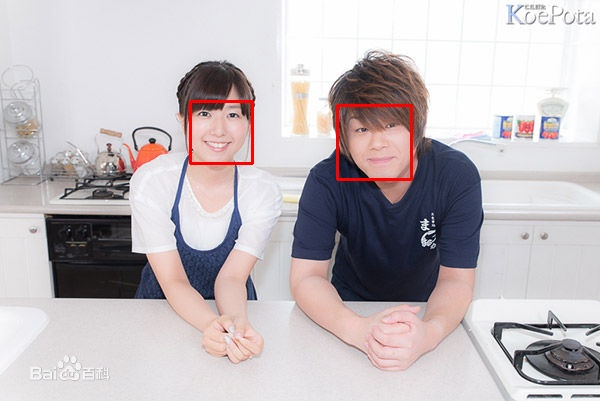

#### (2) 人脸识别

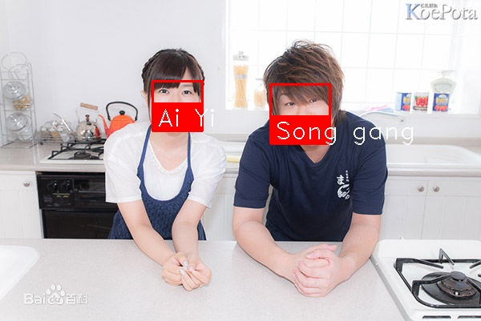

#### (3) 物体识别

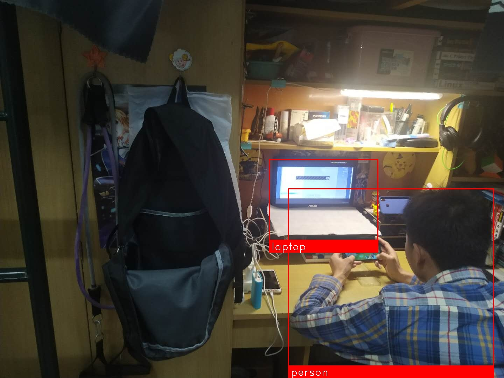

#### (4) 摄像头实时人脸识别

#### (5) 工人防护设备识别

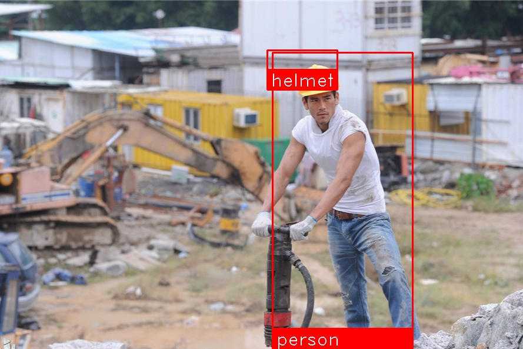

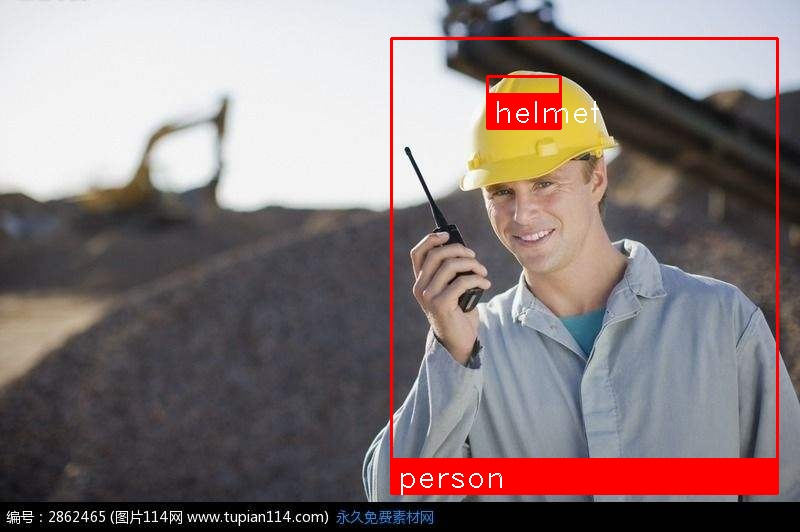

### 使用opencv识别微生物虾的个数

使用颜色通道过滤完成草莓的识别、微生物虾的个数识别（会出现边缘连接的问题）

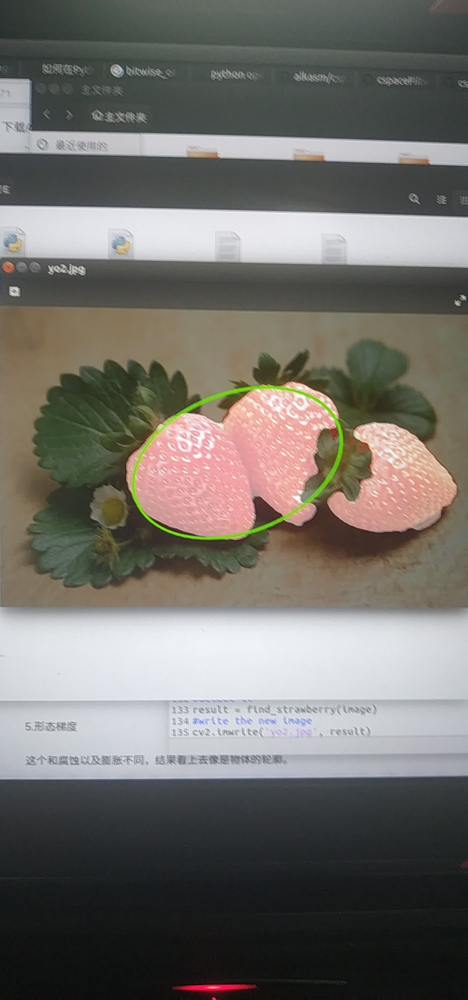

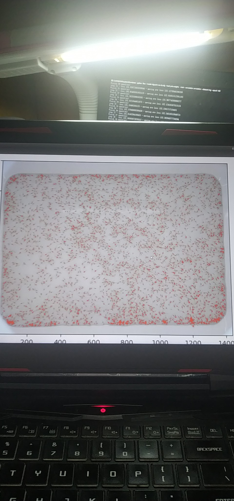

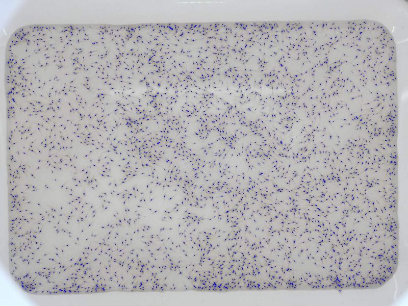

### 基于Yolo、高德地图、科大讯飞制作的博物馆智能播报系统

蒙娜丽萨:

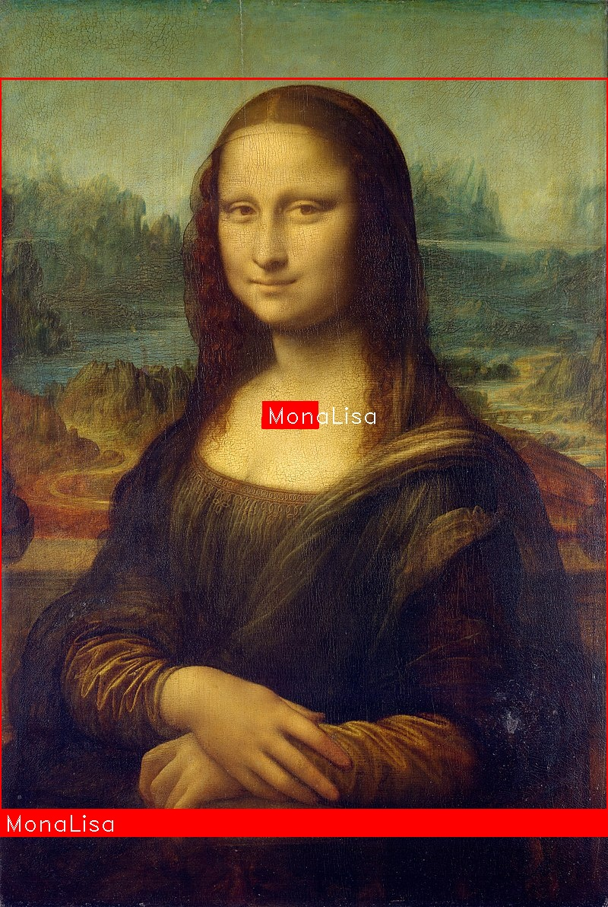

十二生肖:

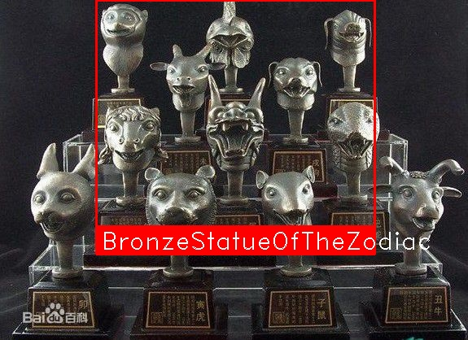

大维德花瓶:

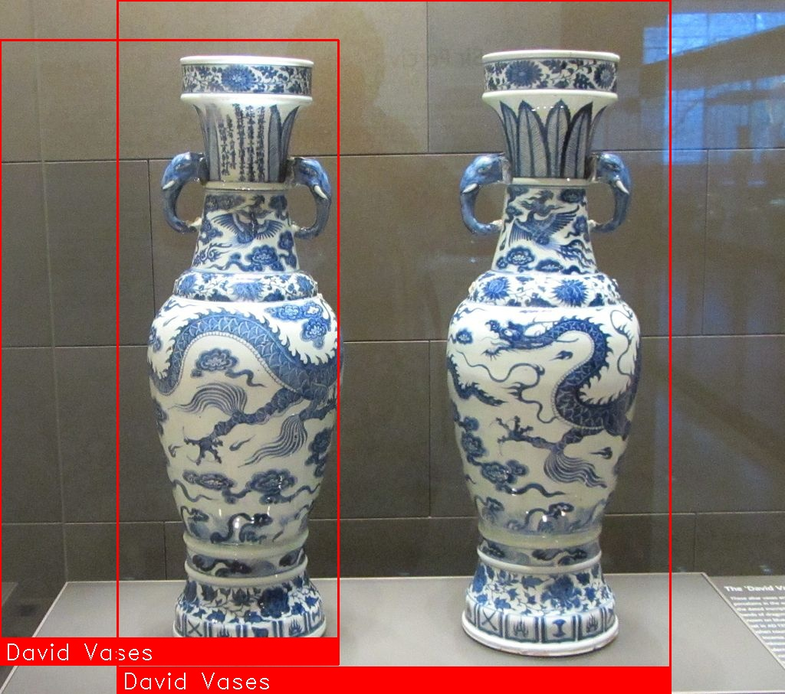

思母戊大方鼎:
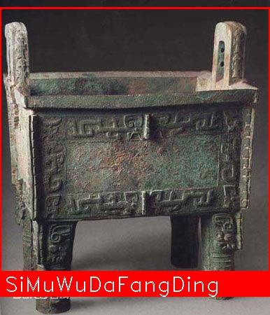

越王勾践剑:
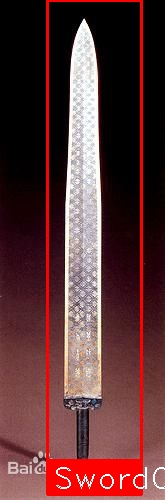

APP演示：

### 基于Yolo制作的中医药识别安卓app

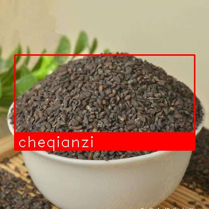

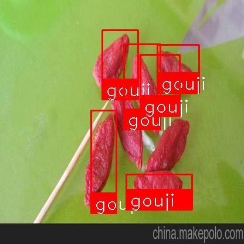

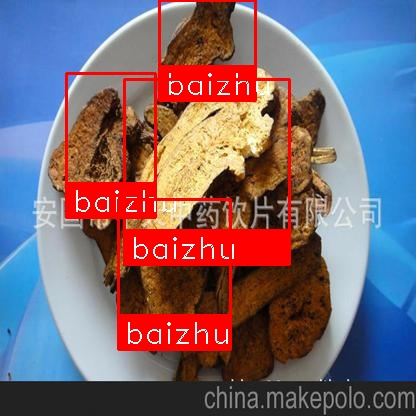

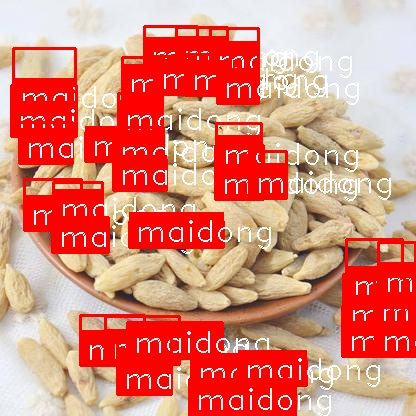

### 参考模型

#### Yolo（you only look once）.

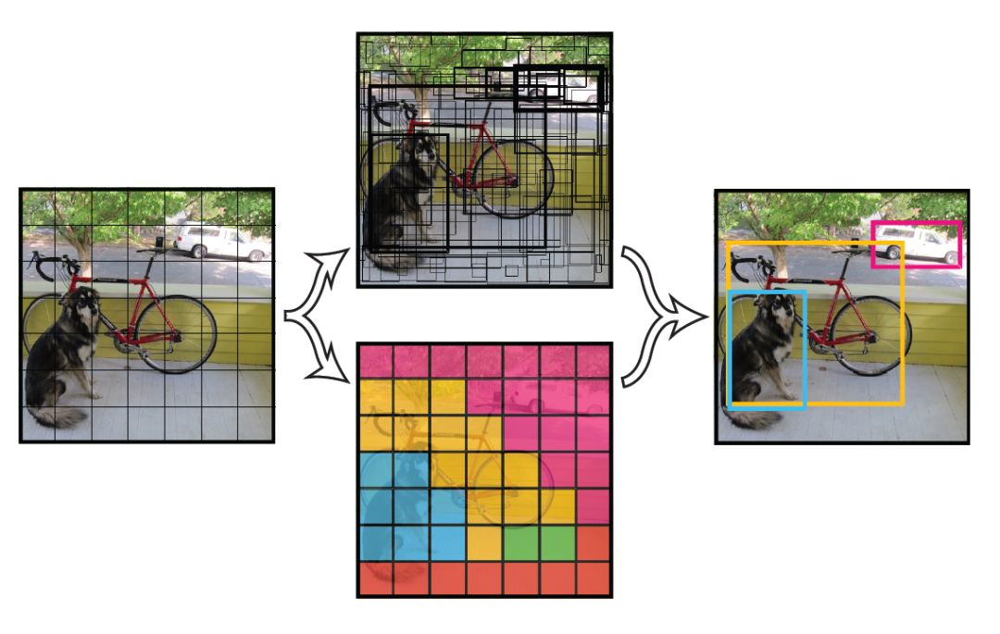

#### face recognition

#### [darkflow](https://github.com/thtrieu/darkflow) [Android YOLO](https://github.com/szaza/android-yolo-v2)

### 关于我

Github:https://github.com/Qinxianshen

CSDN: https://blog.csdn.net/Qin_xian_shen

个人博客: http://saijiadexiaoqin.cn/

Gitchat:https://gitbook.cn/gitchat/author/59ef0b02a276fd1a69094634

哔哩哔哩：https://space.bilibili.com/126021651/#/

微信公众号：松爱家的小秦

更多LIVE：

[如何利用 Selenium 爬取评论数据？](https://gitbook.cn/gitchat/activity/59ef0fbf54011222e227c720)

[Neo4j 图数据库在社交网络等领域的应用](https://gitbook.cn/gitchat/activity/5a310961259a166307ceadb4)

[如何快速编写小程序商城和安卓 APP 商城](https://gitbook.cn/gitchat/activity/5b628776ff984e633d987f7d)

